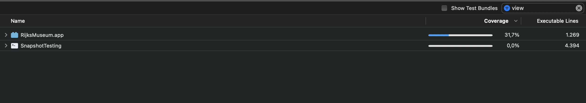

# RijksMuseum

# Install
* Add **API_Key** in APILinksFactory.swift

# App Structure

* App structure I use **MVVM** with Combine. I selected **MVVM** because the app is simple only 2 screens.

* I used the **Repository** design pattern to act as a Data source from API.

* I Separated the data source of UICollectionView to other class **PhotosCollectionViewDataSource**.

* I use **CellReusable** protocol and create 2 extensions for UICollectionView to reduce code when reusing the cell.

* Used `Reachable` and `Reachability.swift` to check the internet connection state.

* Used `LoggerProtocol` and `ProxyLogger.swift` to help me to log the errors.

* Used `MemoryMonitor` to clear the cached data when memory warning fired.

* Use `DataLoader.swift` to get data from local JSON.

* I created Extension for UIImageView to download the image from the link.

* I used [SwiftLint](https://github.com/realm/SwiftLint) to enhance Swift style.

* I create UI with code.

* I used **SPM** (Swift Package Manager).

* I supported Dark-Light Mode

* I supported Orientation

# UnitTest
* I apply  **Arrange, Act and Assert (AAA) Pattern** [AAA](https://medium.com/@pjbgf/title-testing-code-ocd-and-the-aaa-pattern-df453975ab80) in Unit Testing.
* I use mocking to Test get data from  NetworkManager, I use the same JSON file to mock data.
* Test get data from API and From Local JSON.
* Code coverage +30% (Use Unit-test, Snapshot-test and UITest)

## Demo

## Info

Name: Dimo Hamdy

Email: dimo.hamdy@gmail.com
